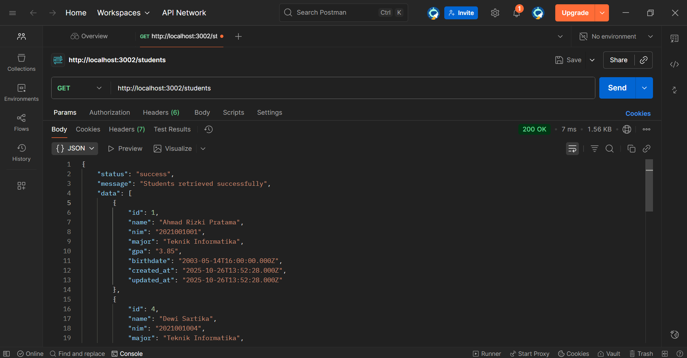
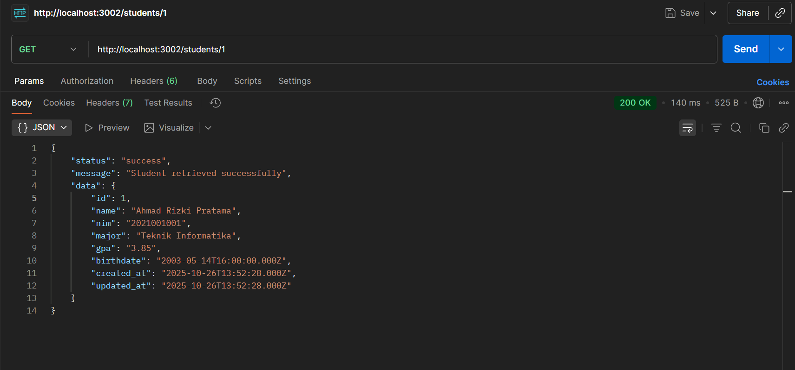
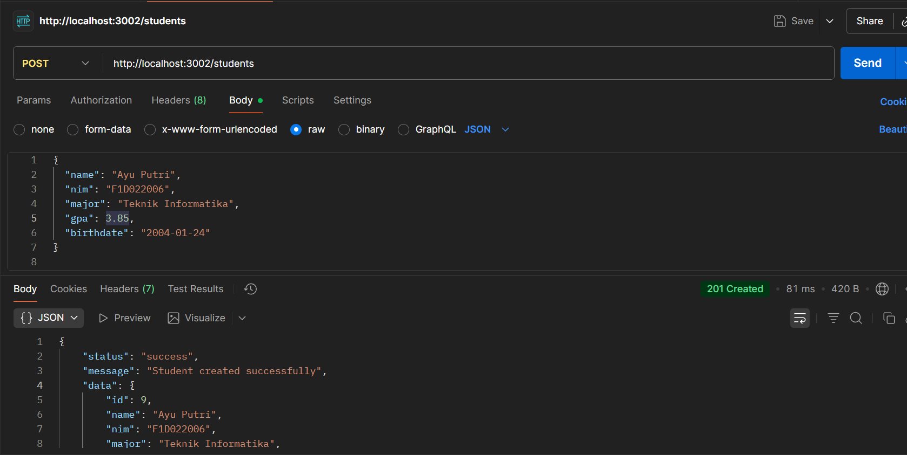
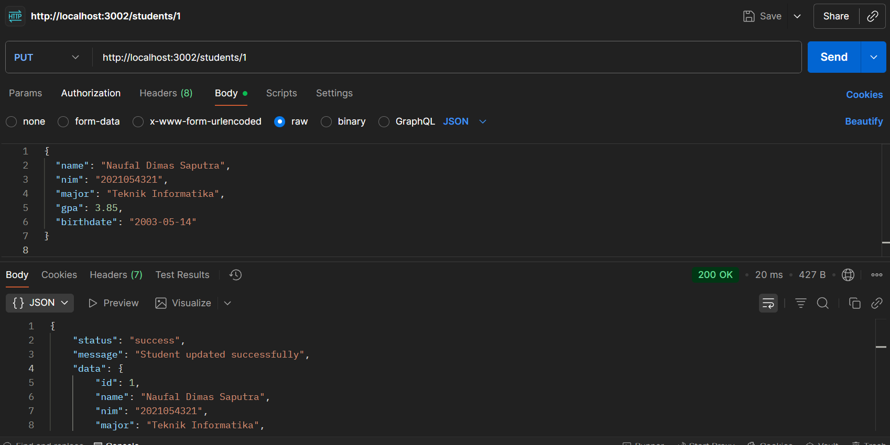

# UTS Students API - Mini Project

REST API CRUD sederhana untuk manajemen data mahasiswa menggunakan Express.js dan MySQL.

## 📋 Deskripsi Project

Project ini adalah implementasi REST API untuk sistem manajemen data mahasiswa yang memenuhi requirements UTS dengan fitur CRUD lengkap (Create, Read, Update, Delete).

## 🏗️ Struktur Project

```
uts-students-api/
├── src/
│   ├── config/
│   │   ├── database.js          # Konfigurasi koneksi database
│   │   └── uts_students_db.sql  # Schema dan sample data
│   ├── controllers/
│   │   └── studentController.js # Business logic untuk students
│   ├── middleware/
│   │   ├── errorHandler.js      # Error handling middleware
│   │   ├── logger.js            # Request logging middleware
│   │   └── validate.js          # Input validation middleware
│   ├── models/
│   │   └── studentModel.js      # Data access layer
│   ├── routes/
│   │   └── studentRoutes.js     # Route definitions
│   └── app.js                   # Main application file
├── screenshots/                 # Screenshot hasil testing API
├── .env                        # Environment variables
├── package.json                # Dependencies dan scripts
└── README.md                   # Dokumentasi project
```

## 📊 Database Schema

Tabel `students` dengan 7 kolom sesuai requirements:

| Kolom      | Tipe         | Deskripsi                        |
| ---------- | ------------ | -------------------------------- |
| id         | INT (PK, AI) | Primary key                      |
| name       | VARCHAR(255) | Nama mahasiswa                   |
| nim        | VARCHAR(20)  | NIM mahasiswa (unique)           |
| major      | VARCHAR(255) | Jurusan mahasiswa                |
| gpa        | DECIMAL(3,2) | IPK mahasiswa (kolom angka)      |
| birthdate  | DATE         | Tanggal lahir (kolom tanggal)    |
| created_at | TIMESTAMP    | Tanggal dibuat (kolom tanggal)   |
| updated_at | TIMESTAMP    | Tanggal diupdate (kolom tanggal) |

## 🚀 Instalasi dan Setup

1. **Clone atau download project**
2. **Install dependencies:**

   ```bash
   npm install
   ```

3. **Setup database:**

   - Buat database MySQL
   - Import file `src/config/uts_students_db.sql`
   - Atau jalankan script SQL secara manual

4. **Konfigurasi environment:**

   - Copy `.env` dan sesuaikan dengan konfigurasi database Anda

   ```
   PORT=3002
   NODE_ENV=development
   DB_HOST=localhost
   DB_USER=root
   DB_PASS=your_password
   DB_NAME=uts_students_db
   ```

5. **Jalankan aplikasi:**

   ```bash
   # Development mode
   npm run dev

   # Production mode
   npm start
   ```

## 📡 API Endpoints

Base URL: `http://localhost:3002`

### 1. GET /students

Mengambil semua data mahasiswa

**Response:**

```json
{
  "status": "success",
  "message": "Students retrieved successfully",
  "data": [...],
  "count": 8
}
```

### 2. GET /students/:id

Mengambil data mahasiswa berdasarkan ID

**Response:**

```json
{
  "status": "success",
  "message": "Student retrieved successfully",
  "data": {
    "id": 1,
    "name": "Ahmad Rizki Pratama",
    "nim": "2021001001",
    "major": "Teknik Informatika",
    "gpa": 3.85,
    "birthdate": "2003-05-15",
    "created_at": "2024-01-01T00:00:00.000Z",
    "updated_at": "2024-01-01T00:00:00.000Z"
  }
}
```

### 3. POST /students

Membuat mahasiswa baru

**Request Body:**

```json
{
  "name": "John Doe",
  "nim": "2021001009",
  "major": "Teknik Informatika",
  "gpa": 3.75,
  "birthdate": "2003-06-15"
}
```

### 4. PUT /students/:id

Mengupdate data mahasiswa

**Request Body:**

```json
{
  "name": "John Doe Updated",
  "nim": "2021001009",
  "major": "Sistem Informasi",
  "gpa": 3.8,
  "birthdate": "2003-06-15"
}
```

### 5. DELETE /students/:id

Menghapus mahasiswa berdasarkan ID

## 🛡️ Middleware

1. **Logger Middleware**: Mencatat setiap request (method + URL + timestamp)
2. **Validation Middleware**: Memvalidasi input untuk POST dan PUT
   - Validasi nama, nim, major (string tidak kosong)
   - Validasi GPA (angka 0.0-4.0)
   - Validasi birthdate (format YYYY-MM-DD)
3. **Error Handler Middleware**: Menangani error 404 dan 500

## 🧪 Testing dengan Postman

Hasil testing API telah didokumentasikan dalam folder `screenshots` dengan penjelasan sebagai berikut:

1. **GET /students** - Mengambil semua mahasiswa
   

2. **GET /students/1** - Mengambil mahasiswa dengan ID 1
   

3. **POST /students** - Membuat mahasiswa baru
   

4. **PUT /students/1** - Update mahasiswa dengan ID 1
   

5. **DELETE /students/1** - Hapus mahasiswa dengan ID 1
   

## ✨ Fitur Tambahan

- Input validation yang komprehensif untuk data mahasiswa
- Validasi NIM unique constraint
- Validasi GPA range (0.0-4.0)
- Validasi format tanggal lahir
- Error handling yang proper
- Response format yang konsisten
- Logging untuk monitoring
- Environment-based configuration
- Sample data mahasiswa untuk testing

## 🔧 Dependencies

- **express**: Web framework untuk Node.js
- **mysql2**: MySQL client dengan Promise support
- **dotenv**: Environment variable management
- **nodemon**: Development tool untuk auto-restart

## 👨‍💻 Author

**Nama**: Gusti Ayu Devi Anjani Putri  
**NIM**: F1D022006
**Mata Kuliah**: Pemrograman Web Lanjut  
**Tugas**: UTS Mini Project - CRUD dengan Express.js + MySQL
